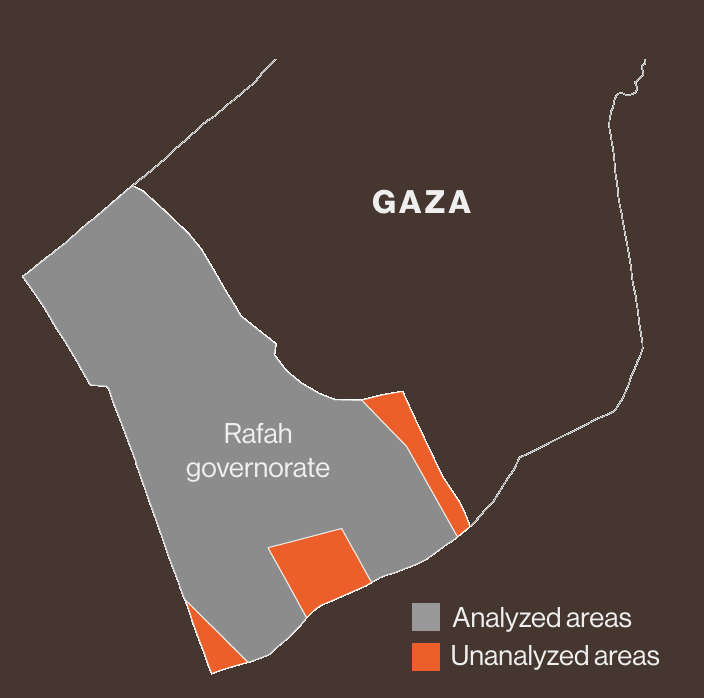

# Tent detections in Rafah
This repository contains a shapefile of detected tents and other new structures in Rafah (see the Coverage Map section for details), as visualized in the article [A Detailed Map Shows How Airstrikes and Refugees Reshaped Rafah](https://www.bloomberg.com/graphics/2024-map-gaza-rafah-israel-hamas-war/). Tent detections were created by training a machine learning model (see Methodology section for more details) on a pair of SkySat images from [Planet Labs PBC](https://planet.com) from Nov. 10, 2023 and March 28, 2024.

## Dataset Description
The file `rafah_tents.zip` contains a shapefile of detected tents and other new structures in the Rafah governorate. The data is projected in EPSG:2039. The shapefile detections correspond to model outputs that were generated at 0.5 meter resolution (which matches SkySat imagery), but median filtering and additional cleaning operations may result in detections appearing at lower resolution.

## Caveats
Data corresponds to tents and other new structures as observed on March 28, 2024. While Bloomberg made attempts to validate the underlying data, errors still exist. Bloomberg identified primary sources of false positives caused by structures with variable brightness, building debris, and shadows in densely built areas. When analyzed on top of other datasets (e.g. in GIS software such as QGIS), tent detections may not perfectly align due to georeferencing errors from the underlying pair of satellite images used.

## Coverage Map
The image below shows areas that were analyzed within the Rafah governorate. Missing areas were due to coverage gaps from the underlying SkySat imagery.

## Methodology
Bloomberg used high resolution SkySat satellite imagery from Planet to find new tents and structures in the Rafah governorate. Bloomberg trained an XGBoost machine learning model, trained on two orthorectified satellite images collected on Nov. 11, 2023 (pre-migration) and March 28, 2024 (recent). These particular images were chosen for their comprehensive geographic coverage, alignment and consistent shadow angles, all of which are crucial for accurate change detection. More recent imagery from April 3, 2024, did not meet these specific criteria and was not used.

The input to the classification model is a 12-dimensional vector that includes the red, green, and blue spectral values from both images, along with transformations into hue, saturation and value. Pixels with tents and no tents were labeled across Rafah through a manual comparison of satellite imagery and verification through analysis of drone and on-the-ground imagery. In total, 740 positive (tent) and 637 negative (no tent) samples were labeled, attempting to capture geographic diversity across the region.

From training and tuning through five-fold cross validation, the best resulting model achieved 96% accuracy. A median filter was applied to smooth out noise. A threshold of 0.7 was selected to identify pixels that belonged to tents and other newly built structures. GDAL was used to vectorize the model results, and Mapshaper was used to further clean the data.
